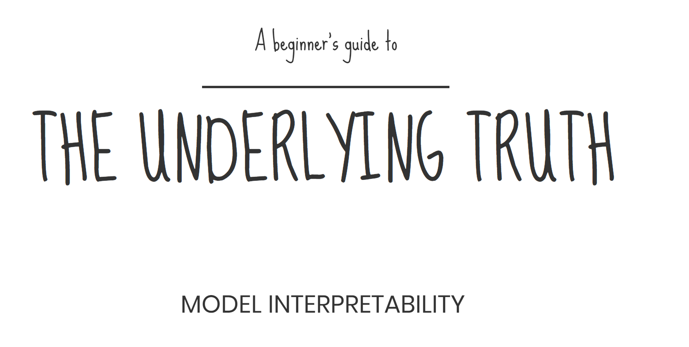

# Model Interpretability

####        

## Authors:

Abhishek Gargha Maheshwarappa

* [LinkedIn ](https://www.linkedin.com/in/abhishek-g-m/)

Kartik Kumar

* [LinkedIn ](https://www.linkedin.com/in/hellokartikkumar/)

## **Mentor:**

**Nicholas Brown**
 \(Assistant Teaching Professor,  Multidisciplinary Graduate Engineering Programs, Northeastern University\)

* [LinkedIn ](https://www.linkedin.com/in/nikbearbrown/)

