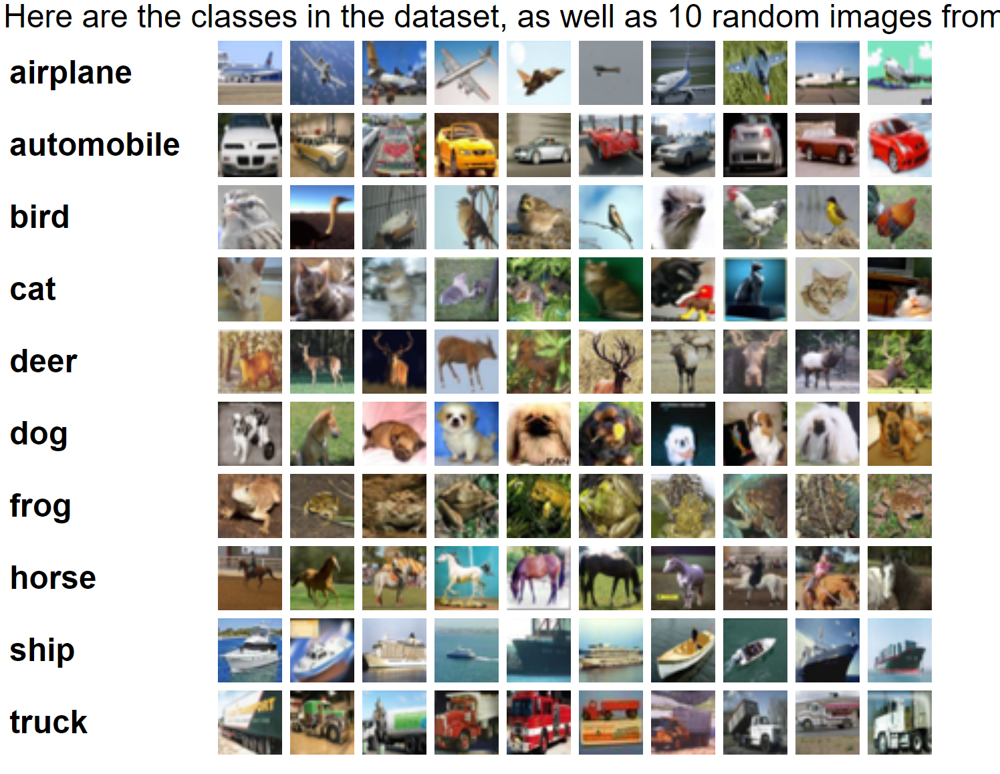

# CIFAR-10 dataset

CIFAR that is [Canadian Institute For Advanced Research](https://en.wikipedia.org/wiki/Canadian_Institute_for_Advanced_Research) has made a collection of images which is used by many data enthusiasts. It is widely used for research in Computer Vision and Deep Learning.The CIFAR-10 dataset contains 60,000 32x32 color images in 10 different classes.The 10 different classes represent airplanes, cars, birds, cats, deer, dogs, frogs, horses, ships, and trucks. There are 6,000 images of each class.

