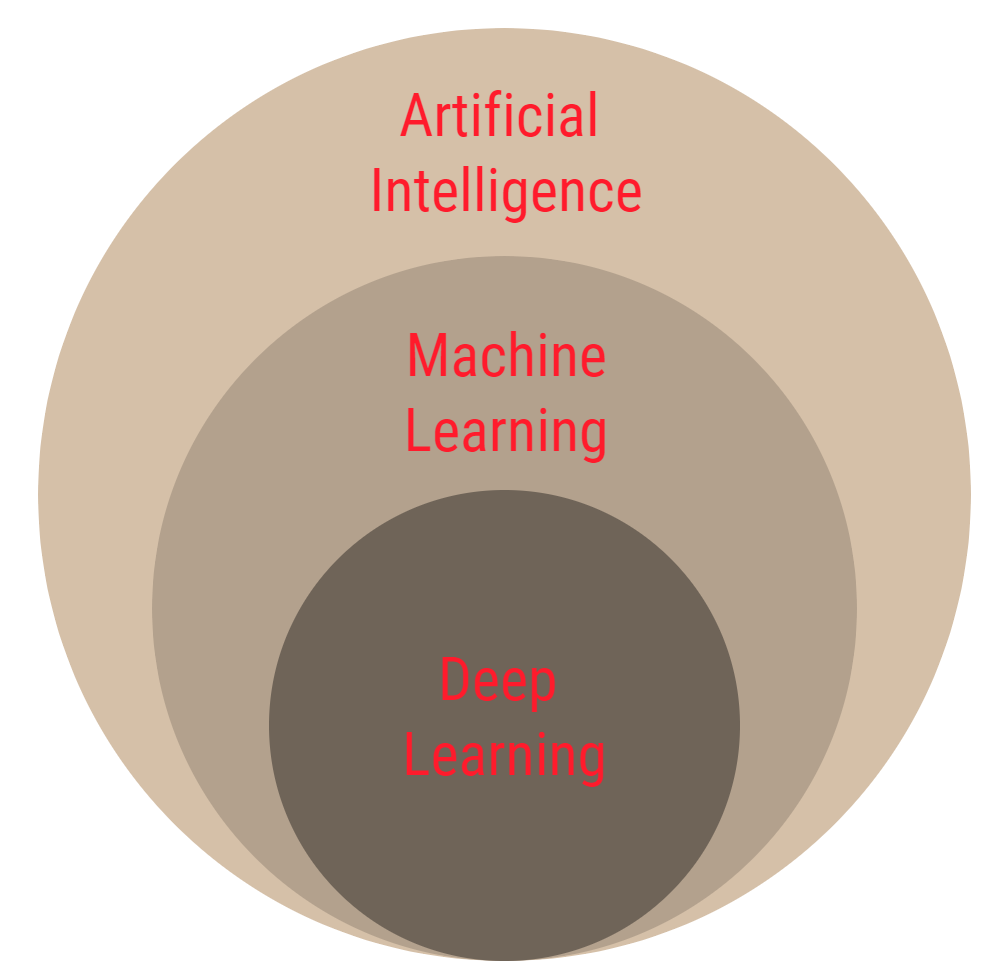

# Deep Learning

Deep Learning is a subset of machine learning, which uses multiple layers of neural networks and it can be supervised or unsupervised learning. Deep Learning is a powerful machine to produce actionable results.

Deep Learning provides methods to learn the underlying features in the data without need for hand engineering for all the underlying features.  

