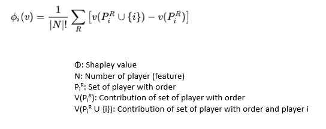

# Model Interpretability

The deep learning models are difficult to interpret compared to the linear models. To interpret the deep learning let us consider an example of convolution neural network for the classification of the image.   
****

### **SHAP \(SHapley Additive exPlanations\)** 

SHAP is a one of the local explanation method that satisfies several desirable local explanation properties . Given a sample and its prediction, SHAP decomposes the prediction additively between features using a game-theoretic approach.

It is introduced by Lundberg et al. who proposed a unified approach to interpreting model predictions.

## Shapley Value 

Let us consider project in a course which requires to deliver 100 lines of code and consists of team of 3 and have work as team present the project within a dead line to get grades. 

Lets consider James\(J\), Robert\(R\) and Susan\(S\)  are the 3 members of the team.Then

| Students | Lines of code |
| :--- | :--- |
| J | 10 |
| R | 30 |
| S | 5 |
| JR | 50 |
| RS | 40 |
| SJ | 35 |
| JRS | 100 |

| Order | James contribution | Robert contribution | Susan Contribution |
| :--- | :--- | :--- | :--- |
| J,R,S | 10 | 40 | 50 |
| J,S,R | 10 | 60 | 30 |
| R,J,S | 20 | 30 | 50 |
| R,S,J | 65 | 30 | 5 |
| S,R,J | 35 | 60 | 5 |
| S,J,R | 65 | 30 | 5 |

| Contributor | Shapely Calculation | Shapely Value |
| :--- | :--- | :--- |
| James | 1/6\(10+10+20+65+35+65\) | 34.17 |
| Robert | 1/6\(40+60+30+30+60+30\) | 41.7 |
| Susan | 1/6\(50+30+50+5+5+5\) | 24.17 |

We have 3 students so the total combination is 3! which is 6.

Shap gives the feature importance assigned to every feature which will correspond to the contribution by it.

