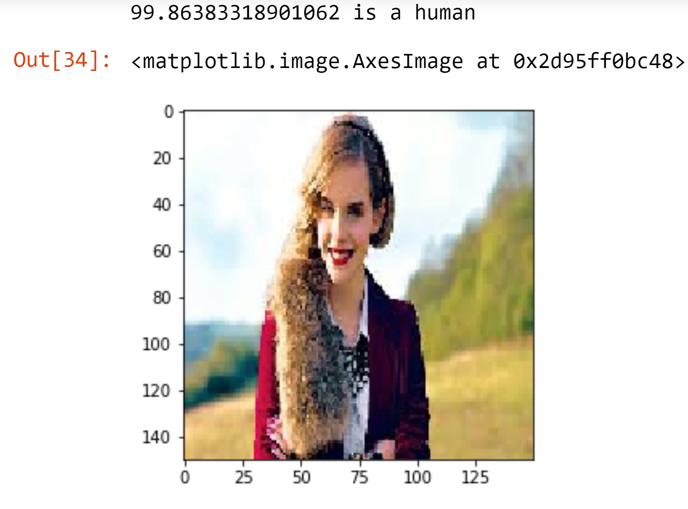
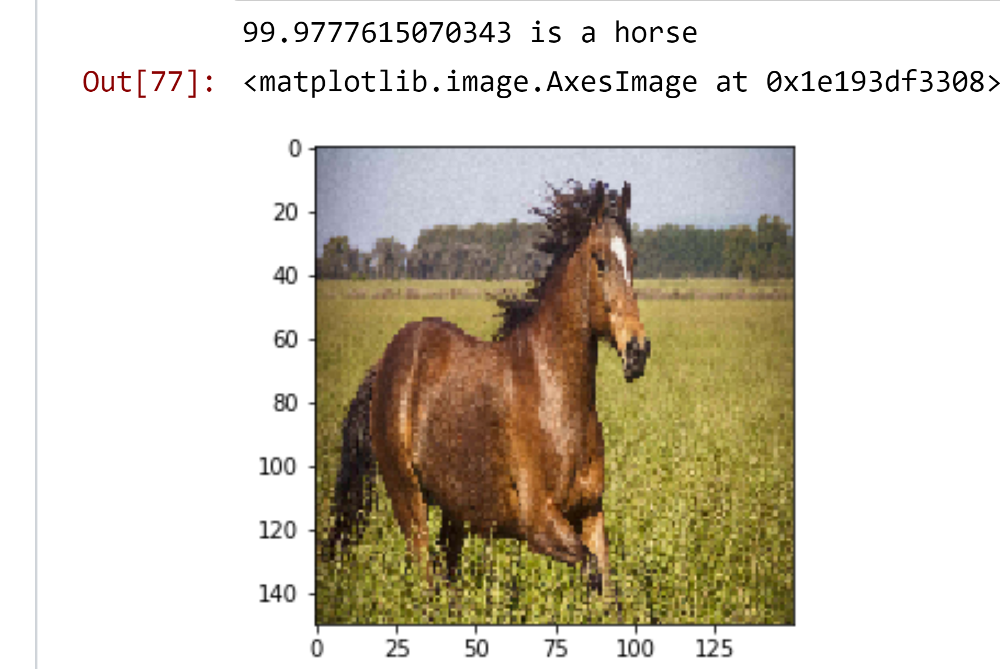

# Interpretable Methods

The deep learning models are difficult to interpret compared to the linear models. To interpret deep learning let us consider an example of a convolution neural network for the classification of the image.  ****

‌Let us consider an example of this application, classification of images of horses and humans.

‌‌ The model predicts whether a particular image is of human or horse

‌ Once the model is trained, the model is fed with real-word images

The model output 

Now horse image fed into the model

Now one more human image is fed

The model does really good work in predicting the image which it didn't see.

We are dealing with 3 methods of inprepetation in this book. They are :

## **SHAP**

SHAP is one of the local explanation methods that satisfies several desirable local explanation properties.

## LIME

LIME focuses on training local surrogate models to explain individual predictions

## TCAV

