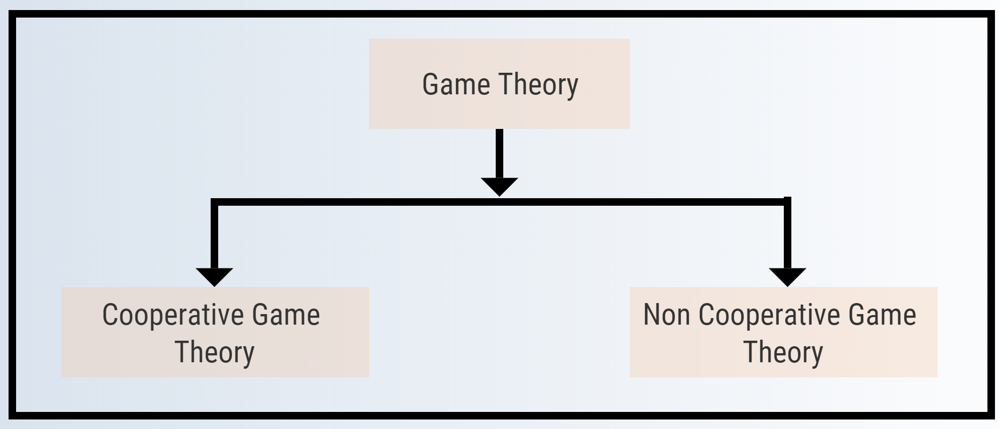

# SHAP

### **SHAP \(SHapley Additive exPlanations\)**

In this section we explore what is SHAP and how it will help us interpret a deep learning model. Given a sample and its prediction, SHAP decomposes the prediction additively between features using a game-theoretic approach.

Game theory was initially developed by John von Neumann and Oskar Morgenstern in 1944 as a mathematical theory. Following on from this, in 1944 Neumann published The Theory of Games and Economic Behavior co-authored with Morgenstern. This is considered to be one of the main foundation texts of game theory. But the economist John Nash, John Harsanyi, and Reinhard Selten received the Nobel Prize for Economics in 1994 for further developing game theory in relation to economics.

### Game theory

‌Game theory is the process of modeling the strategic interaction between two or more people in a situation containing set rules and outcomes in which each person's payoff is affected by the decision made by others. Game theory is used by the economist, political scientist, military and others.

#### Non Cooperative Game theory 

Non-Cooperative game theory is a competitive social interaction where there will be some winners and some losers. It is where Nash equilibrium comes into play. This doesn't deal in detail about game theory. To read more about nash equilibrium refer to an article from [Investopedia](https://www.investopedia.com/terms/n/nash-equilibrium.asp). The non-cooperative game theory is best understood with the example of the [Prisoner's Dilemma](https://www.investopedia.com/terms/p/prisoners-dilemma.asp).

#### Cooperative Game theory

Cooperative Game theory is where every player has agreed tp work together toward a common goal. Like nash equilibrium cooperative game theory has shapely values. In a game theory a coalition is what you call a group of players in a cooperative game.

#### Shapely values

A method of dividing up the gains or costs among player acording to value of their individual contributions . 

It rests on three important pillars 

#### Marginal contribution

The contribution of each player is determined by what is gained or lost by removing them from the Game. This is called their marginal contributions. To make it clear lets take an example.

#### Shapely values

A method of dividing up the gains or costs among player acording to value of their individual contributions . 

It rests on three important pillars 

#### Marginal contribution

The contribution of each player is determined by what is gained or lost by removing them from the Game. This is called their marginal contributions. To make it clear lets take an example.

‌ 

It was introduced by Lundberg et al - who proposed a unified approach to interpreting model predictions.

‌‌Let us consider a project in a course that requires delivering 100 lines of code and consists of a team of 3 individuals who have worked as a team to present the project within a deadline to get good grades.

‌ Let us consider that James\(J\), Robert\(R\) and Susan\(S\) are the 3 members of the team.Then

| Students | Lines of code |
| :---: | :---: |
| J | 10 |
| R | 30 |
| S | 5 |
| JR | 50 |
| RS | 40 |
| SJ | 35 |
| JRS | 100 |

| Order | James contribution | Robert contribution | Susan Contribution |
| :---: | :---: | :---: | :---: |
| J,R,S | 10 | 40 | 50 |
| J,S,R | 10 | 60 | 30 |
| R,J,S | 20 | 30 | 50 |
| R,S,J | 65 | 30 | 5 |
| S,R,J | 35 | 60 | 5 |
| S,J,R | 65 | 30 | 5 |

| Contributor | Shapely Calculation | Shapely Value |
| :--- | :--- | :--- |
| James | 1/6\(10+10+20+65+35+65\) | 34.17 |
| Robert | 1/6\(40+60+30+30+60+30\) | 41.7 |
| Susan | 1/6\(50+30+50+5+5+5\) | 24.17 |

We have 3 students so the total combination is 3!\(3 factorial = 3\*2\) which is 6.

SHAP gives the feature importance assigned to every feature which will correspond to the contribution by it.

‌So our model predicts correct output but now to see what features in image influence this decision, we refer to the SHAP values.

Red pixels increase the model's output while blue pixels decrease the output. The sum of the SHAP values equals the difference between the expected model output \(averaged over the background dataset\) and the current model output. The above image shows the features in the image that are contributing to the model output. Now, one can see this output and tell what actually leads the model to classify if the image has horse or human.

The corresponding python notebook is present in the github and one can try it hands on and understand its working practically and can play with notebook to understand better.

