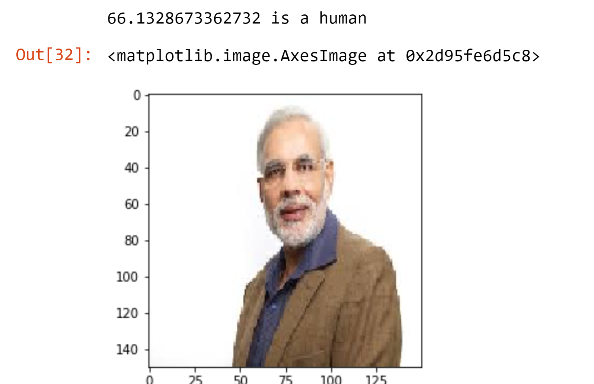

# Shap interpretation

The convolutional neural network \(CNN\) is a class of deep learning neural networks and it represents an important part of computer vision application of image classification.

‌ Let us consider an example of this application, classification of images of horses and humans.

‌ The model predicts whether a particular image is of human or horse

‌ Once the model is trained, the model is fed with real-word images

The model output 

Now horse image fed into the model

Now one more human image is fed

So the model predicts correct output but now to see what features in image influence this decision, this provided by the Shap values.

Red pixels increase the model's output while blue pixels decrease the output. The sum of the SHAP values equals the difference between the expected model output \(averaged over the background dataset\) and the current model output. The above image shows the features in the image that are contributing to the model output. Now one can see this output and say what actually leads the model to classify the image has horse or human.

