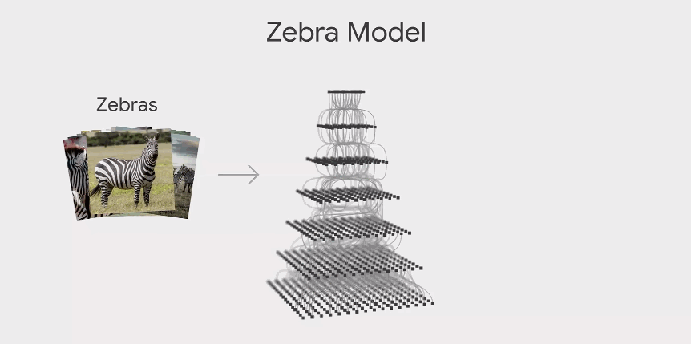

# TCAV

### **Introduction**

TCAV is the latest breakthrough for model interpretability in the 21st century. It helps achieve interpretability beyond feature attribution. TCAV is short for Testing with Concept Activation Vectors. TCAV is an initiative by Google AI in a bid to make AI more responsible and transparent. 

In his keynote address at Google I/O 2019, Google CEO Sundar Pichai talked about how they are trying to build a more helpful Google for everyone which also includes building AI for everyone. 

TCAV is the latest breakthrough for model interpretability in the 21st century. It helps achieve interpretability beyond feature attribution. TCAV is short for Testing with Concept Activation Vectors. It is an initiative by Google AI, in a bid to make AI more responsible and transparent. 


TCAV allows quantitative testing with concept activation vectors to get model explanations.

### Definition 

TCAV gives quantitative explanations about how much a concept is important for predictions in a trained model. These can be used even with concepts that are not important to the trained model.

### Non technical Explanation

Let's take an example of evaluating how a kid identifies Elephants. We are not going into the details of how the kid learnt this differentiation. We are more keen to understand what concepts the kid has made in his/her mind with respect to an elephant.

We test the concepts by showing the kid 10 images of which 6 are elephants and 4 are other animals. The kid is super smart and correctly selects 5 elephants from the given 10 images. How did he miss the 6th one? We asked the kid why is the 6th image not an elephant? The kid replies - “Because he does not have a long face!”. This particular image was from a rear view and hence the kid went wrong. This tells us that the kid has used the elephant’s trunk as an important concept of classifying images as elephants. We can continue asking the kid more questions of “why” to understand some more concepts that their brain has built to identify an elephant. The TCAV score for trunk concept, in this case, is simply the ratio of the number images the kid correctly identified to the total number of images it was given i.e., 5/10.

### 
Technical Explanation

What is TCAV looking to achieve? 
To explain this, let's take the example of the Zebra classification.


TCAV is like a microscope that latches on to a model and gives out a score which tells us whether the concept under study was important to the model. 

As shown in the above example, the model is trained to classify zebras and the concept  we chose to test was stripes. TCAV provides the quantitative importance of a concept if and only if the model network learned about it.

When we say we use stripes as a concept, we implement it and get the TCAV score by simply using the activation vectors for that concept. Hence, the name Test Concept with Activation Vectors.

A few prerequisites are needed for implementing TCAV. They are:

* Example images of the concept
* Random images
* Network under investigation and need access to the activation vectors of it

Once we are ready with these, what we need to do is build a linear classifier to separate the concept images from random images. Then, we take an orthogonal vector of the decision boundary.
 Now, we are ready with our CAV. 

**a\) a given set of examples that represent the stripes concept  
b\) independent data set with the concept labelled  
c\) trained network  
d\) CAVs are then learned by training a linear classifier to distinguish between the activations produced by a concept’s examples and examples in any layer  
e\) TCAV uses the directional derivative SC,k,l\(x\) to quantify conceptual sensitivity**

So, a CAV is nothing but a direction pointing from away from the random image towards a more concept image.
 What are the next steps? 

Once we have a concept activation vector, the next step is to take the derivative of the probability of the class to the concept vector. This is the directional derivative with CAV.

The intuition behind all this is that if we consider a picture or pixel more like a concept than other concepts, then how much would the probability of being a Zebra changes? 

If it changes a lot, it's important or else it is not important.

This activity was done on many more zebra images to get a reliable explanation. The final TCAV score is simply a ratio of the zebra having stripes that positively increases the probability of being a zebra. In layman terms, it is like asking - for 100 images, how many of the images returned positive directional derivatives?

### Pros and Cons

#### Pros

* Address the subjectivity by bringing in quantitative methods
* Easy for the human to understand what model does globally

#### Cons

* Need ingredients like concept image and random image to develop CAV
* Difficulty in implementation compared other techniques like lime and saliency.

For more information refer Google [Tcav](https://research.google/pubs/pub47077/)

