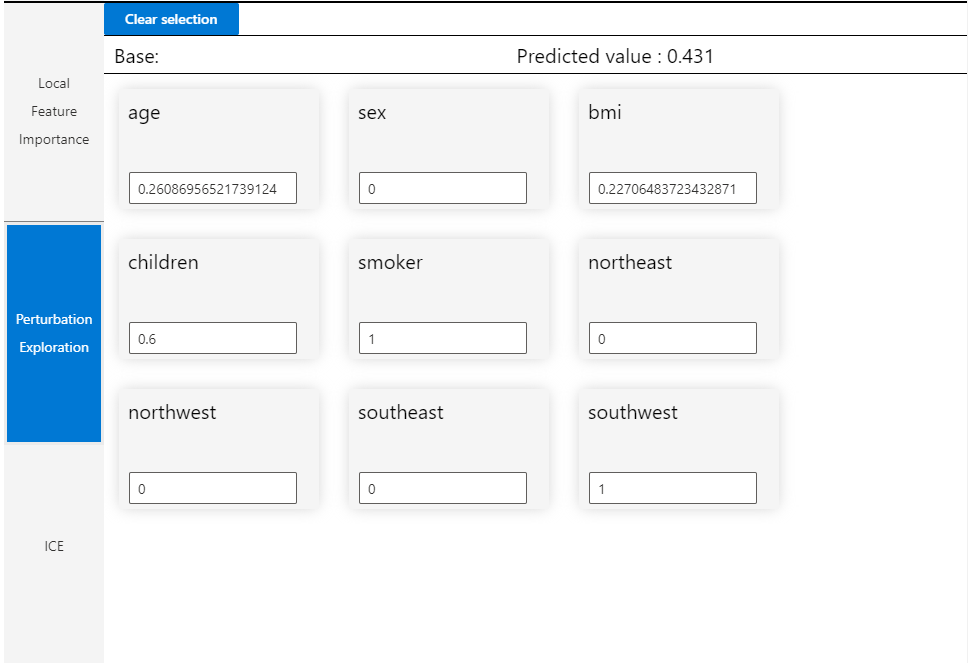
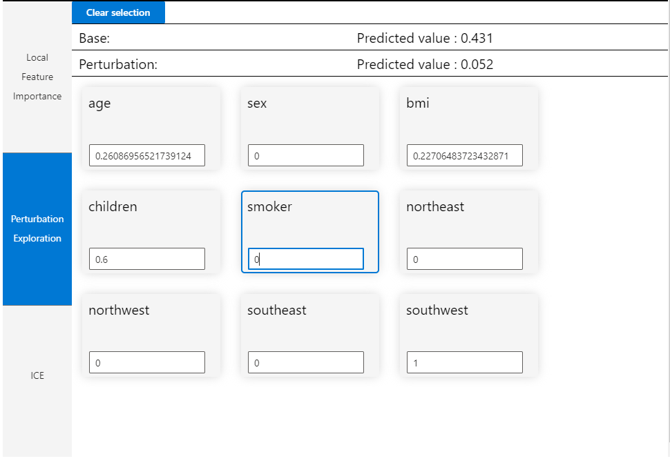
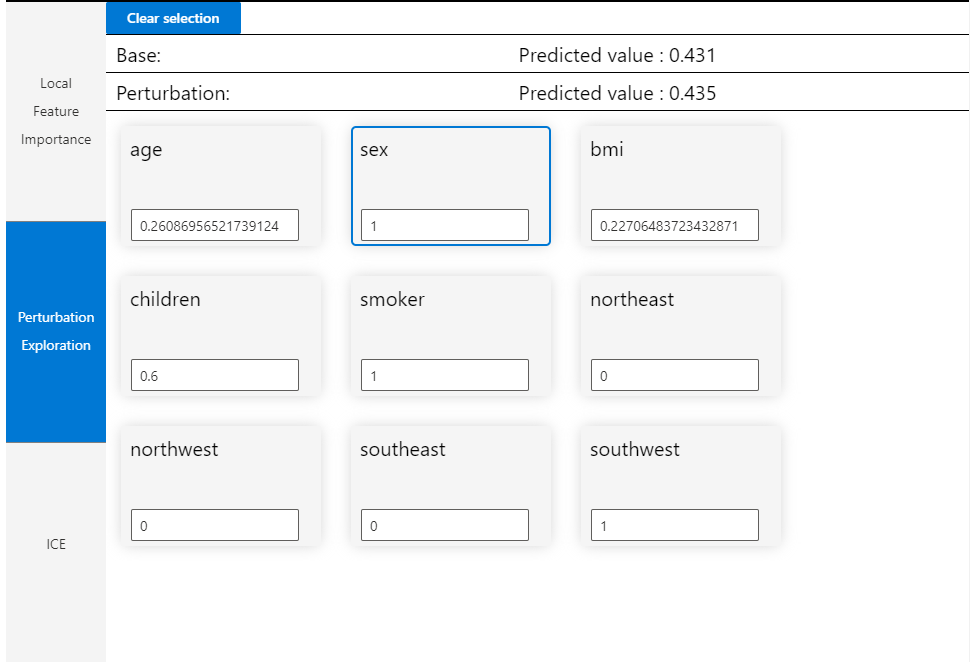

# Understanding the Visualizations

The dashboard is very overwhelming at first sight isn’t it? 

Notice how we have selected age for the X value and PredictedY\(charges\) as Y value in the first half of our dashboard that helps give global visualization on our model. We can select any feature from our dataset as X and Y values and view the plot for our test data. 

You must also notice that we have selected a particular point in our global visualization plot. This point corresponds to age of 0.261 and PredictedY of 0.431. This was a random selection since we wanted to further study this particular point’s local visualizations. 

The local visualizations plot automatically appears when we select a point in our global visualization plot. These visualizations help us understand the top features impacting the output at that particular instance. As we can see, for the age = 0.261,  smoker has a high positive effect whereas age and bmi have negative effects. The K features scroll bar on top of this plot let’s us dynamically visualize the importance of k number of features. Highly useful when we have a lot of features! 

On selecting Perturbation Exploration, we get to experiment with our feature values and see how the changed values affect the output. Below is a sample:

This is the original feature data for the selected sample.  

So the selected sample is a male smoker with 3 children. Let us see how the charges would vary if he were a non smoker.   

In the above picture, you can see we have simply changed the value of smoker to 0 and a Perturbation value for the output appears on top. The new predicted charges is 0.052. Clearly quitting smoking will be beneficial health-wise and monetarily! Let us try with another feature to grow our experimentation.   

Ok, in this iteration, we can see the predicted charges if the sample were a female. The perturbation shows a predicted value of 0.435. Not too different from the original value. So the medical charges are not too different for males or females. Although, there is some increase in charges for females. 

This is just a glimpse of the power of automated machine learning. There are many more insights and experimentation that one can make use of with this dashboard. We highly recommend reading this [blog post](https://medium.com/microsoftazure/automated-and-interpretable-machine-learning-d07975741298) if you are interested in knowing more.

