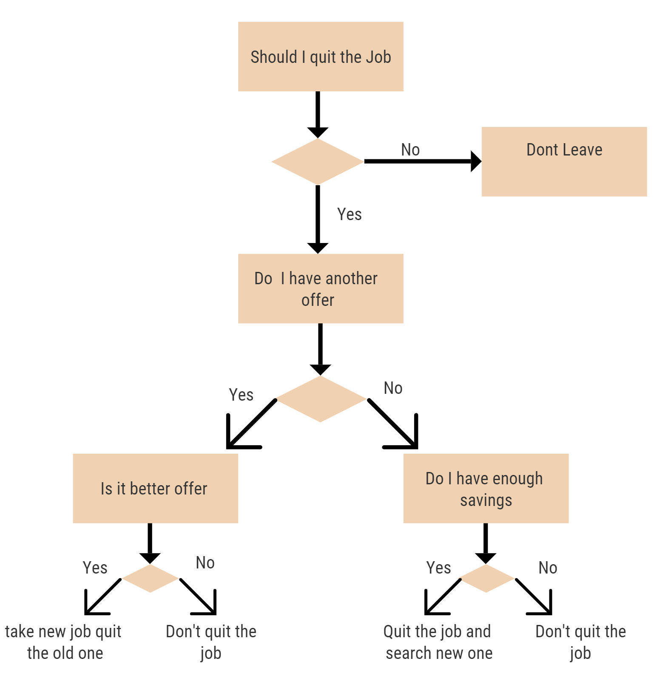

# Interpretable Machine learning models

In this section of the book, we want to discuss in detail about the interpretable machine learning models. These are simple models that are used widely in many applications all around us. We will be diving deep into the model explanation for these simple models. 

For example, when you buy a toaster it is self-explanatory in itself about how it should be used and there will be no need for other people to explain how to operate the toaster. The same is the case with interpretable machine learning models.

This book discusses two interpretable models 

1. Linear regression
2. Decision Tree

Every machine learning engineer or data scientist learns these two models the first or in every university and in every course work will contain these two machine learning models. The rationale behind this is they are easy to understand and learn from. These models make sense to human understanding and people can easily connect them with their daily life easily.

Take for example linear regression in daily life, when a person is looking for an apartment he after looking a few apartments and knowing the price and other information like the size of the house, number of rooms, number of bathrooms he will be able approximate the apartment cost which is doesn't know based the details of rooms, size, bathrooms, and others.

Now for the decision tree in daily life, the following picture will help us understand how decision tree are used in daily life.

But there cases where interpretable machine learning models fail to self-explanation. For example when there is multicollinearity or when there is an interaction effect among the features the linear models fail to explain themselves without the help of other methods. Which will be discussed briefly in this book.

