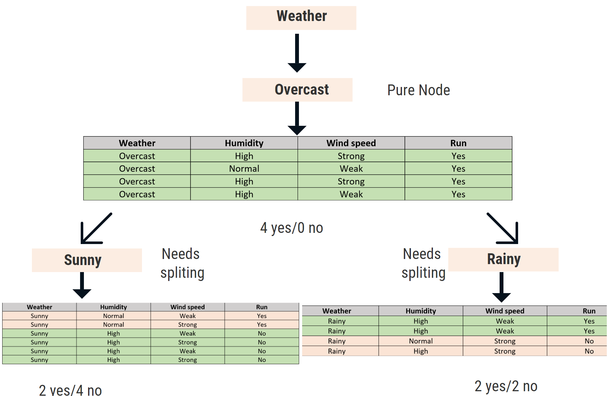

# Decision Trees

Decision Trees are used to predict a target variable based on the decision made on subset of data in a tree format. Any classification or regression problem can be solved using Decision Trees. The main idea is to find the most impactful features and place them towards the root of the tree. As the tree deepens, the subset becomes smaller, and the predictions become accurate for that subset of data. Let use an example to understand how decision tree works

Consider the below table where we have four columns : Weather, Humidity, Wind speed and Run

Our target variable is "Run" and the other three columns are our feature inputs.

Decision Tree is a non-parametric method, a supervised learning algorithm for classification problems.

Explaining the terminology related to the decision is not in the scope of this book, these can be read from [ISLR](http://faculty.marshall.usc.edu/gareth-james/ISL/)

 How the decision tree will classify this

As can be seen, the node Overcast is pure since it has only one output that is to go for a run. So we now know that if the weather is the overcast person will go for a run. But if the weather is not overcast then if it is rainy or sunny doesn't have an output, it has yes or no. So needs further splitting it deduce it more.

Till now you can consider the angel telling us which attribute to split on, now let us know how the angel knows which attribute to select.

**Which attribute to split on?**

It is based on the measure of the purity of the split, entropy helps to measure the purity of the split. Entropy is the way to measure the uncertainty of class in a subset. 

