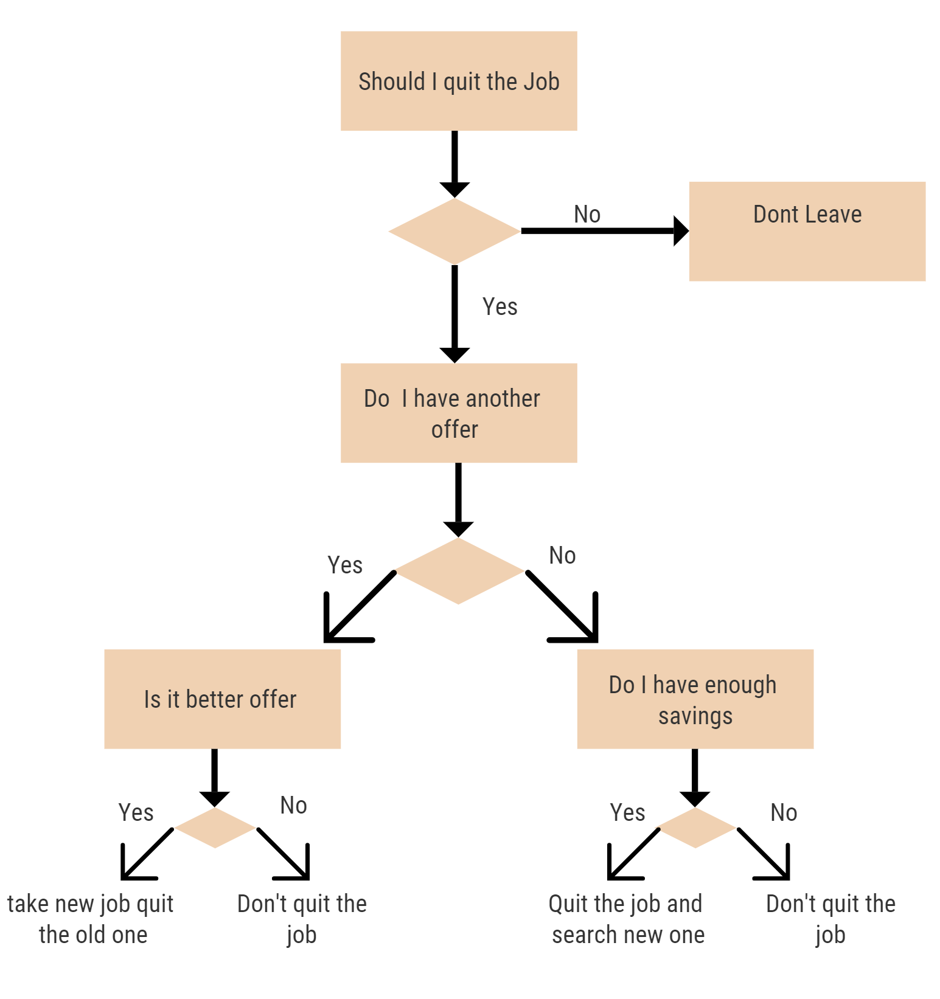

# Decision Trees

Decision Tree models are one of the oldest machine learning algorithms along with Linear regression. Decision Tree models allow users to explicitly see the decisions made in determining a prediction. As given in the name, these decisions are made in a tree format. Decision Trees are a non-parametric method and supervised learning algorithm that are generally used for classification problems\(can be used for regression as well\).

The reason Decision Trees are prevalent is because they are easy to interpret. Humans can understand the decisions made by a Decision Tree model because that is also how humans make a decision.  

To understand the an example of Decision Trees in daily life, consider the following picture:

The Decision Tree above depicts simple decision making that one would make. At every step in the tree, asking the right question either leads us to an answer or the next important question that will in turn lead us to an answer.

The key here is to find the most important features that impact a prediction and place them towards the root of the tree. As the tree deepens, we see nearly all the features that impact the model for all the predictions made by the model. 

One major limitation of Decision Trees is that they tend to overfit the training data and do not perform well on new data. This occurs when the tree is too deep. It learns the feature impact on the data for the training data alone and the performance on test data gets hampered.

Decision trees are widely used in Operations research and Operations management. There are many different algorithms that were developed based on the Decision Tree principle such as RandomForest, XGBoost, GBM, etc. These algorithms were made in such a way that the model does not overfit the training data. 

