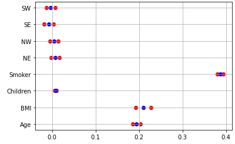

# Statistical Interpretation

### 

### **The summary of our OLS model is as below:** 

The summary is indeed a very detailed one. To understand what features are significantly impacting our prediction, we will take a closer look at the "t" statistic or the "p" value. Both of these can help us decide if a feature is significant or not. 

**t-statistic**

A definition that can be found on the Princeton University website\([link](https://dss.princeton.edu/online_help/analysis/interpreting_regression.htm)\)is: "_The t statistic is the coefficient divided by its standard error. The standard error is an estimate of the standard deviation of the coefficient, the amount it varies across cases. It can be thought of as a measure of the precision with which the regression coefficient is measured._ "

In the case of the "t" statistic, if the value is below -2 or above +2, we can say that the feature is significant. Refer to the OLS table and we can observe that all features are significant except "sex" which has a t-value between -2 and +2. So this leads us to the conclusion that "sex" is not an important feature when building a linear model on this data. All the other "t" values are either below -2 or above +2. This confirms that these are the significant parameters in our data and "sex" is not to be considered in modeling or future model plots. If you want to know why the +2/-2 values, in particular, were chosen, have a look at this [article](https://blog.minitab.com/blog/adventures-in-statistics-2/understanding-t-tests-t-values-and-t-distributions).

**p-statistic**

If we were to choose the "p" value to determine significant features, we would say that all the features with a "p" value below a threshold are significant. The general threshold value is 0.05, but this can be changed if the data scientist wishes to. In our table, we can see that all the columns that were significant as per the "t" statistic, have low "p" values and the significance is consistent. 

**Coefficient values**

Let's go on to interpret the table further. The following plot shows the results of the previous linear regression model.  

Notice that in the above weight plot, all weights are between 0 and 1. This is because the data has been normalized before fitting the model. The weight plot shows that being a smoker has a strong positive effect on the charges. Other features that have a reasonable positive effect are the 'BMI' and 'Age' of an individual.  

To explain each and every metric of our summary will be a lengthy job. For the purpose of this book, we will only focus on the individual feature coefficients. We have explained how to read the "t" and "p" values from the table. If you are interested in understanding the other metrics fully, you can read [this](https://medium.com/@jyotiyadav99111/statistics-how-should-i-interpret-results-of-ols-3bde1ebeec01).

Let’s have another look at the table more closely focused on the part we want to interpret.  

#### _A simple way to interpret this model is in the form of an equation is :_

**charges =**  0.1899\*age + 0.2017\*bmi + 0.3807\*smoker - 0.0422\*northeast - 0.0470\*northwest - 0.0587\*southeast - 0.0568\*southwest

**Interpretation of a numerical feature \(age\)**: An increase of the age by 1 unit increases the charges by the factor of 0.1899 \(when all other features remain fixed\). This means that for an increase of 1 year in age, the Insurance Premium charges go up by 18.99%. Another reason to wish we could stay younger!

**Interpretation of a categorical feature \(smoker\)**: The estimated number of charges is 0.38 times more for a smoker - again assuming that all other features do not change. So this means that a smoker will incur 38% more charges than a non-smoker. Another reason to quit smoking y’all.

All the interpretations always come with the footnote that “all other features remain the same”. This is because of the nature of linear regression models. As indicated earlier, this is a major assumption of the linear model. The predicted target is a linear combination of the weighted features. The estimated linear equation is a hyperplane in the feature/target space \(a simple line in the case of a single feature\). The weights specify the slope \(gradient\) of the hyperplane in each direction. 

The good side is that the additivity isolates the interpretation of an individual feature effect from all other features. That is possible because all the feature effects \(= weight \* feature value\) in the equation are combined with an additional operation. On the bad side of things, the interpretation ignores the joint distribution of the features. Increasing one feature, but not changing another, can lead to unrealistic or at least unlikely data points. For example, increasing the number of rooms might be unrealistic without also increasing the size of a house. Similarly, in our data set, increasing the number of children without increasing the age would not make sense.   
  
  
[​The Notebook with the implementation of the Assumptions](https://colab.research.google.com/drive/1LaZshGOsYrxfw9MDu7oTHrj7wTyvQV9m?usp=sharing)

