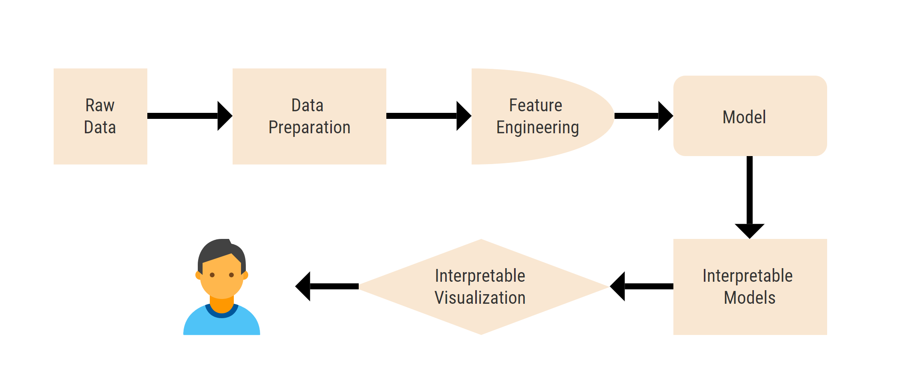

# Interpretability

## What is interpretability? 

Interpretability can be defined as the amount of consistently predicting a model’s result without trying to know the reasons. It is easier to know the reason behind certain decisions or predictions if the interpretability of a machine learning model is higher. Interpretability and explainability are often used interchangeably but have different purposes. To understand the difference, consider a school student in a chemistry lab, doing a little experiment on titration. The titration can be broken down into different stages and each stage can be interpreted if the next stage output can be predicted, done until the final outcome is found out. This is interpretability. And the chemistry behind this experiment is the definition of explainability. There is no mathematical definition of interpretability. A \(non-mathematical\) definition by Miller \(2017\) is: Interpretability is the degree to which a human can understand the cause of a decision.  The higher the interpretability of a machine learning model, the easier it is for someone to comprehend why certain decisions or predictions have been made. A model is better interpretable than another model if its decisions are easier for a human to comprehend than decisions from the other model.

## How does one achieve interpretability? 

There are no clear measures for measuring interpretability but there has been a lot of progress in this field. Google AI recently innovated TCAV which allows an individual to test a model on concepts it has generated through training. Microsoft has also been keeping up to trends with Azure Machine Learning Studio. Azure ML empowers developers and data scientists to make models and interpret them with great visualization tools, all on the cloud! While companies continuously work to make innovative technological advancements in this field, traditional methods continue to provide a good base with model interpretation. These methods include Global surrogates, Feature interaction, PDPs, Shapley, LIME, etc.  In this book, we will give a "hands on" with a few of these methods, namely - OLS, AzureML, LIME, SHAP and TCAV. We have taken multiple datasets to interpret and coded in python to demonstrate how to achieve interpretability. 

