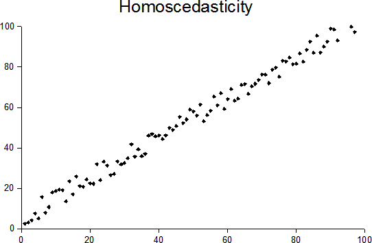

# Assumptions

Whether a linear model is the "right" model or not depends on some underlying assumptions associated with this model. They are:

### **Linearity Assumption**: 

The prediction/target variable is assumed to be a linear combination of features/explanatory variables, which is both its greatest strength and its greatest limitation. If you suspect feature interactions or a nonlinear association of a feature with the target value, you can add interaction terms or use regression splines.

### **Normality Assumption:** 

The target outcome, given the features, follows a normal distribution. If this assumption is violated, the estimated confidence intervals of the feature weights are invalid.

### **Homoscedasticity \(constant variance\) Assumption**: 

Homoscedasticity describes a situation wherein our error term' variance is assumed to be the same across all values of independent variables. Suppose we are to predict the value of a house given the living area in square meters. You estimate a linear model that assumes that, regardless of the size of the house, the error around the predicted response has the same variance. This assumption is often violated in reality. In the house example, it is plausible that the variance of error terms around the predicted price is higher for larger houses, since prices are higher and there is more room for price fluctuations. Suppose the average error \(difference between predicted and actual price\) in your linear regression model is 50,000 Euros. If you assume homoscedasticity, you assume that the average error of 50,000 is the same for houses that cost 1 million and for houses that cost only 40,000. This is unreasonable because it would mean that we can expect negative house prices. Below graphs should help visualize this concept more

### **Independence
 Assumption**: 

Each instance is independent of any other instance. However, if we are to perform repeated measurements, such as multiple blood tests per patient, the data points are not independent. For such cases consisting of dependent data, we will need special linear regression models, such as mixed effect models or GEEs. 

### **Fixed features
 Assumption:** 

The input features are considered “fixed”. Fixed means that they are treated as “given constants” and not as statistical variables. So we assume that there are no measurement errors. This is a rather unrealistic assumption, we can never quantify our environment and features completely. Without that assumption, however, we would have to fit very complex measurement error models that account for the measurement errors of your input features.

### **Absence of multicollinearity
:**

We do not want strongly correlated features in our dataset. If we have them, we can mess up the estimation of the weights. In a situation where two features are strongly correlated, it becomes problematic to estimate the weights because the feature effects are additive and it becomes indeterminable to which of the correlated features is to be considered.

 

  

