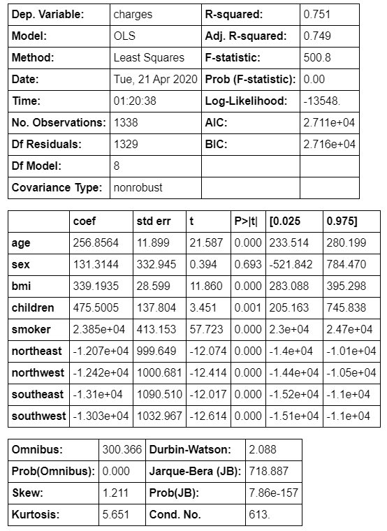
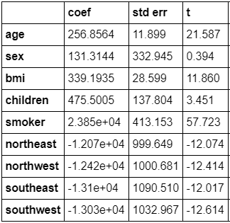

# Model

Now that we have established the prerequisite knowledge required to build a Linear Regression model. Let us dive in and build a model for our dataset.

We want to make a model that will help us predict the charges given all the other features of an individual. You can refer to a step-by-step guide on how to build the model in our jupyter notebook \(insert link\). For now, all that is needed to be understood is that we have an OLS method to make our model. 

### **The summary of our OLS model is as below:** 

The summary is indeed a very detailed one. To explain each and every metric of our summary will be a lengthy job. For the purpose of this book, we will only focus on the individual feature coefficients and t statistics for every feature. If you are interested in understanding the other metrics fully, you can read \*\*insert article link\*\*

Let’s have another look at the table more closely focussed on the part we want to interpret.  

#### A simple way to interpret this model in form of an equation can be written as:

//insert equation

Interpretation of a numerical feature \(age\): An increase of the age by 1 year increases the log likelihood of charges by 0.1886, when all other features remain fixed. This means that for an increase of 1 year in age, the charges go up to e0.1886\(=1.2\) So there is an increase by 20% in the charges for every year as we age. Another reason to wish we could stay younger!

Interpretation of a categorical feature \(“smoker”\): The estimated number of charges is e0.38 time more for a smoker - again assuming that all other features do not change. So this means that a smoker will incur 46% more charges than a non smoker. Another reason to quit smoking y’all.

All the interpretations always come with the footnote that “all other features remain the same”. This is because of the nature of linear regression models. The predicted target is a linear combination of the weighted features. The estimated linear equation is a hyperplane in the feature/target space \(a simple line in the case of a single feature\). The weights specify the slope \(gradient\) of the hyperplane in each direction. The good side is that the additivity isolates the interpretation of an individual feature effect from all other features. That is possible because all the feature effects \(= weight times feature value\) in the equation are combined with a plus. On the bad side of things, the interpretation ignores the joint distribution of the features. Increasing one feature, but not changing another, can lead to unrealistic or at least unlikely data points. For example increasing the number of rooms might be unrealistic without also increasing the size of a house.  
  

