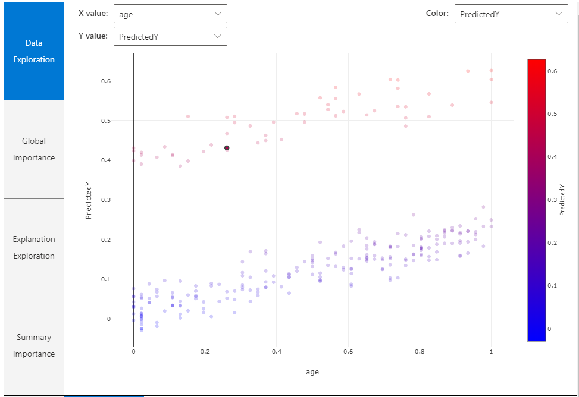
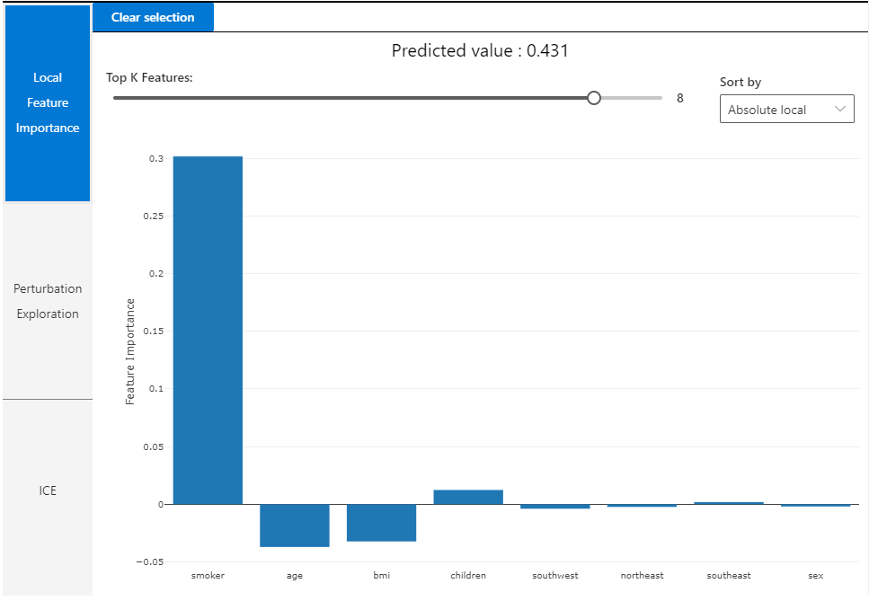

# Tabular Explainer Dashboard

TabularExplainer calls one of the four SHAP explainers underneath \(TreeExplainer, DeepExplainer, LinearExplainer, or KernelExplainer\), and automatically selects the most appropriate one for our use case. We can however, call each of its four underlying explainers directly. 

This explainer will help us make an Explanation dashboard which gives global and local visualizations to help interpret our model. 

Ok, so now that we have a brief idea of how automated machine learning helps achieve interpretability, let’s dive into some code and interpret some models!

You can refer to the code in our github. Here, we will show the visualizations achieved with the code. \(Be sure to run pip install azure ml-interpret before running the code\)

### Explanation Dashboard are made of:

#### Global visualizations

The following plots provide a global view of the trained model along with its predictions and explanations

| Plot | Description |
| :--- | :--- |
| Data Exploration | An oreview of the dataset along with prediction values. |
| Global Importance | Shows the top K\(configurable K\) important features globally. This chart is useful for understanding the global behavior of underlying model. |
| Explanation Exploration | Demonstrates how a feature is responsible for making a change in model's predicition values\(or probability of predicition values\) |
| Summary | Uses a signed local feature importance values across all data points to show the distribution of the impact each feature has on predicition value. |

#### Local visualizations

You can click on any individual data point at any time of the preceding plots to load the local feature importance plot for that point 

| Plot | Description |
| :--- | :--- |
| Local Importance | Shows the top K\(configurable K\) important features globally. This chart is useful for understanding the local behaviour of the underlying model on specific data point. |
| Perturbation Exploration | Allows you to change feature values of the selected data point and observe how those changes will affect predicition value. |
| Individual Conditional Expectation | Allows you change a feature value from a minimum value to a maximum value to see how the data point's predicition changes when feature changes. |

###  

